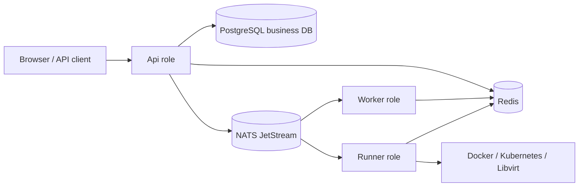

# NoCTF

NoCTF is a competition platform for CTF, AWD, AWDP, and KoH, built with .NET 10
and Nuxt 4. The current product and architecture contract lives in
[the authoritative documentation index](docs/README.md).

## Capabilities

- Four built-in game modes: CTF, AWD, AWDP, and KoH.
- Reusable challenge templates with competition-specific scoring, hints, and runtime configuration.
- Durable submission evaluation, lifecycle, runtime, notification, and leaderboard workflows through Wolverine.
- Docker, Kubernetes, and Libvirt runtime providers selected by deployment-level Runner pools.
- On-demand leaderboard projection with PostgreSQL facts, Redis snapshots, and SignalR updates.
- Strongly typed FastEndpoints contracts and a generated TypeScript OpenAPI client.
- Stable-resource GitOps workflows through ordinary Organizer Bot identities and existing management APIs.

Penetration content is ordinary CTF content, not a separate game mode. Dynamic game-mode
plugins and in-process business queues are not part of the target architecture.

## Architecture

The three production roles can run in one composable host or as independent processes:



- `NoCTF.API` owns HTTP, authentication, authorization, and SignalR.
- `NoCTF.Worker` owns durable business processing and leaderboard projection.
- `NoCTF.Runner` owns provider operations and checker/patch execution.
- `NoCTF.Host` enables any non-empty combination of `Api`, `Worker`, and `Runner` and
  defaults to all three. Combined roles still communicate through durable NATS JetStream queues.
- PostgreSQL is the business source of truth; NATS JetStream is the Wolverine durable transport.
- Redis holds replaceable caches, rate limits, the SignalR backplane, subscriptions, and Runner presence/capacity.

Docker challenge services publish only their declared TCP ports and request host port
`0`; Docker assigns the random host ports used to expand public URLs. The platform does
not add an HAProxy or ingress-proxy layer for Docker runtimes.

## Technology

- Backend: .NET 10, FastEndpoints, EF Core 10, Npgsql/PostgreSQL, Wolverine, SignalR.
- Frontend: Nuxt 4, Vue 3, TypeScript, Vite, and Bun.
- Infrastructure: PostgreSQL, Redis, local or S3-compatible object storage.
- Runtime providers: Docker Container/Compose, Kubernetes Container/Compose, Libvirt/OVA.
- Tests: TUnit, NSubstitute, and Testcontainers against real dependencies.

## Production Docker Compose

The single Compose definition contains the combined NoCTF Host, PostgreSQL, Redis, NATS,
and an authenticated Registry. It uses prebuilt images and directory bind mounts only.
No ports are published/exposed; operations connects its reverse proxy through the existing
`1panel-network` aliases `noctf-web:8080` and `noctf-registry:5000`.

```bash
bash deploy/init-layout.sh /opt/noctf
# Fill /opt/noctf/.env with the CI image digest, existing/new secrets and real host names.
# Prepare Registry bcrypt credentials and Docker login as described in deploy/README.md.
cd /opt/noctf
docker compose config --quiet
docker compose up -d
```

Migration runs inside NoCTF at startup; image health checks are in the Dockerfile.
Telemetry/exporters and proxy configuration are not deployed. Read
[deployment instructions](deploy/README.md) before migrating an existing installation:
never replace an existing named volume with an empty directory.

## Repository layout

```text
backend/
  src/
    NoCTF.API/             HTTP, auth, SignalR, and the ClientApp Nuxt SPA
    NoCTF.Worker/          durable application processing
    NoCTF.Runner/          runtime-provider execution
    NoCTF.Hosting/         shared role and durable-messaging composition
    NoCTF.Host/            configurable unified process
    NoCTF.Bot/             standalone BOT host
    NoCTF.Bot.Core/        provider-neutral relay, commands and durable state
    NoCTF.Bot.Providers.Milky/  optional Milky chat adapter
    NoCTF.Domain/          domain model and policies
    NoCTF.Application/     capability-oriented use cases
    NoCTF.Infrastructure/  persistence and infrastructure adapters
  tests/NoCTF.Tests/       unit, architecture, and integration tests
deploy/                    local Compose and Kubernetes manifests
docs/                      authoritative product and engineering specifications
```

## Documentation

- [Documentation index and authority](docs/README.md)
- [Product and domain model](docs/product-domain.md)
- [System architecture](docs/architecture.md)
- [Processes, messaging, and concurrency](docs/processes-messaging.md)
- [Runtime contract](docs/runtime.md)
- [API reference](docs/api.md)
- [Deployment boundary](docs/deployment.md)
- [Development guide](docs/development.md)
- [Testing guide](docs/testing.md)
- [Challenge repository GitOps](docs/challenge-repository-gitops.md)
- [Current backend handoff](NoCTF-backend-handoff-2026-07-24.md)
