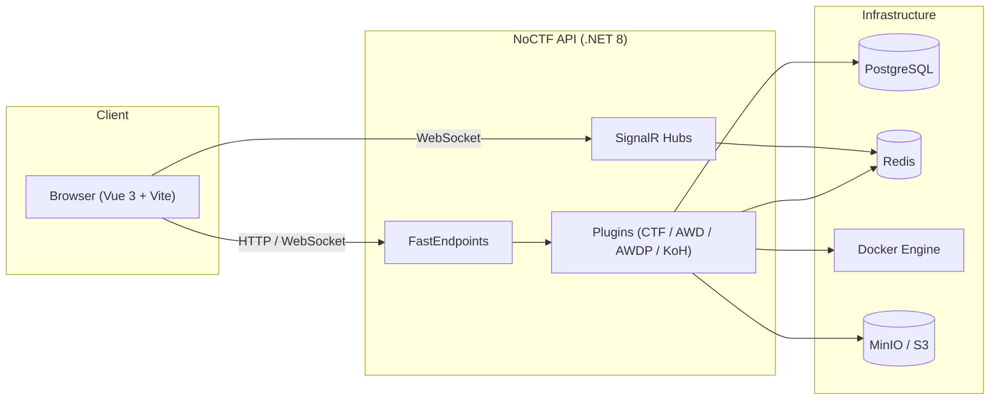

# NoCTF

A modern, extensible CTF/AWD/AWDP/KoH competition platform built with .NET 8 and Vue 3.

## Features

- **Multi-mode support**: CTF (Jeopardy), AWD (Attack with Defense), AWDP (Patch Defense), and KoH (King of the Hill)
- **Penetration challenges**: CTF/Jeopardy challenge type for per-team Docker Compose ranges with staged flags
- **Plugin-based architecture**: Game modes and challenge types load as plugins via `AssemblyLoadContext`
- **Real-time experience**: SignalR hubs power live leaderboards, game notifications, and monitor streams
- **Container-native challenge orchestration**: Docker-based containers for dynamic challenges and checkers
- **Multi-tenancy**: Competitions are fully isolated with EF Core global query filters

## Tech Stack

- **Backend**: .NET 8, FastEndpoints, SignalR, EF Core + PostgreSQL
- **Frontend**: Vue 3, Vite, Bun, Tailwind CSS, shadcn-vue
- **Real-time / Cache**: Redis (SignalR backplane + leaderboard cache)
- **Storage**: Local filesystem or S3-compatible (MinIO)
- **Containers**: Docker
- **Deployment**: Docker Compose or Kubernetes

## Quick Start

1. Copy the example environment file:

```bash
cp .env.example .env
```

2. Edit `.env` with your secrets (at least `POSTGRES_PASSWORD` and `JWT_SECRET`).

3. Start the platform with Docker Compose:

```bash
cd deploy && docker compose up --build -d
```

4. Check the API health endpoint:

```bash
curl http://localhost/api/health
```

5. Open the app in your browser:

```
http://localhost
```

## Project Structure

```
NoCTF/
├── backend/
│   ├── src/
│   │   ├── NoCTF.API/              # Web API, SignalR hubs, auth, middleware
│   │   ├── NoCTF.Application/      # Application services and DTOs
│   │   ├── NoCTF.Core/             # Domain entities and enums
│   │   ├── NoCTF.Infrastructure/   # EF Core, migrations, tenant context
│   │   ├── NoCTF.PluginBase/       # Plugin interfaces (IGameMode, IChallengeType, etc.)
│   │   ├── NoCTF.Container.Docker/ # Docker container manager
│   │   ├── NoCTF.Plugins.CTF/      # CTF game mode plugin
│   │   ├── NoCTF.Plugins.AWD/      # AWD game mode plugin
│   │   ├── NoCTF.Plugins.AWDP/     # AWDP game mode plugin
│   │   ├── NoCTF.Plugins.KoH/      # KoH game mode plugin
│   │   └── NoCTF.Plugins.Penetration/ # Penetration challenge type plugin
│   └── tests/NoCTF.Tests/          # Unit and integration tests
├── frontend/                       # Vue 3 SPA
├── deploy/
│   ├── docker-compose.yml          # Local Docker Compose stack
│   └── k8s/                        # Kubernetes manifests
├── docs/
│   ├── architecture.md             # System architecture and plugin design
│   ├── handoff.md                  # Maintainer handoff and current project context
│   ├── deployment.md               # Docker Compose and K8s deployment guides
│   ├── development.md              # Local development setup
│   ├── game-modes.md               # Game mode mechanics
│   ├── quickstart-test.md          # Manual smoke-test flow
│   └── api.md                      # API and SignalR reference
├── .env.example                    # Example environment variables
└── README.md                       # This file
```

## Architecture Overview



## Documentation

- [Collaborator Handoff](docs/handoff.md)
- [Architecture](docs/architecture.md)
- [Deployment Guide](docs/deployment.md)
- [Development Guide](docs/development.md)
- [Game Modes](docs/game-modes.md)
- [Penetration Challenges](docs/penetration-challenges.md)
- [Penetration Operations](docs/penetration-operations.md)
- [API Reference](docs/api.md)
- [Quickstart Test Guide](docs/quickstart-test.md)

## License

MIT
