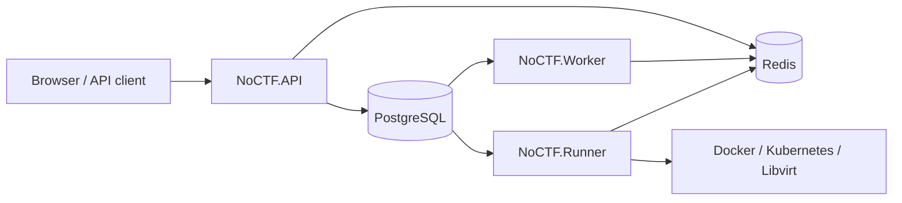

# NoCTF

NoCTF is a competition platform for CTF, AWD, AWDP, and KoH, built with .NET 10
and Vue 3. The current product and architecture contract lives in
[the authoritative documentation index](docs/README.md).

## Capabilities

- Four built-in game modes: CTF, AWD, AWDP, and KoH.
- Reusable challenge templates with competition-specific scoring, hints, and runtime configuration.
- Durable submission evaluation, lifecycle, runtime, notification, and leaderboard workflows through Wolverine.
- Docker, Kubernetes, and Libvirt runtime providers selected by deployment-level Runner pools.
- On-demand leaderboard projection with PostgreSQL facts, Redis snapshots, and SignalR updates.
- Strongly typed FastEndpoints contracts and a generated TypeScript OpenAPI client.
- Stable-resource GitOps workflows through ordinary Organizer Bot identities and existing management APIs.

Penetration content is ordinary CTF content, not a separate game mode. Dynamic game-mode
plugins, in-process business queues, and a supported single-process production mode are
not part of the target architecture.

## Architecture

Production uses three independent processes:



- `NoCTF.API` owns HTTP, authentication, authorization, and SignalR.
- `NoCTF.Worker` owns durable business processing and leaderboard projection.
- `NoCTF.Runner` owns provider operations and checker/patch execution.
- PostgreSQL is the business source of truth and Wolverine persistence store.
- Redis holds replaceable caches, rate limits, the SignalR backplane, subscriptions, and Runner presence/capacity.

Docker challenge services publish only their declared TCP ports and request host port
`0`; Docker assigns the random host ports used to expand public URLs. The platform does
not add an HAProxy or ingress-proxy layer for Docker runtimes.

## Technology

- Backend: .NET 10, FastEndpoints, EF Core 10, Npgsql/PostgreSQL, Wolverine, SignalR.
- Frontend: Vue 3, TypeScript, Vite, Bun, Tailwind CSS, generated OpenAPI SDK.
- Infrastructure: PostgreSQL, Redis, local or S3-compatible object storage.
- Runtime providers: Docker Container/Compose, Kubernetes Container/Compose, Libvirt/OVA.
- Tests: TUnit, NSubstitute, and Testcontainers against real dependencies.

## Local Docker Compose

The checked-in Compose stack is for local development and validation, not a production
deployment template.

```bash
cp .env.example .env
# Set POSTGRES_PASSWORD, JWT_SECRET, SEED_ADMIN_PASSWORD,
# EMAIL_VERIFICATION_ENCRYPTION_KEY, and other local values.
docker compose --env-file .env -f deploy/docker-compose.yml up --build --wait
```

Verify the API and open the bundled frontend:

```bash
curl http://localhost/health
```

Open `http://localhost/` in a browser. Stop the stack without deleting its data volumes:

```bash
docker compose --env-file .env -f deploy/docker-compose.yml down
```

For Docker Runner deployments, set `DOCKER_SOCKET_GID` to the numeric group ID of the
host Docker socket when it is not `0`.

## Repository layout

```text
backend/
  src/
    NoCTF.API/             HTTP, auth, SignalR
    NoCTF.Worker/          durable application processing
    NoCTF.Runner/          runtime-provider execution
    NoCTF.Domain/          domain model and policies
    NoCTF.Application/     capability-oriented use cases
    NoCTF.Infrastructure/  persistence and infrastructure adapters
  tests/NoCTF.Tests/       unit, architecture, and integration tests
frontend/                  Vue SPA and generated API client
deploy/                    local Compose and Kubernetes manifests
docs/                      authoritative product and engineering specifications
```

## Documentation

- [Documentation index and authority](docs/README.md)
- [Product and domain model](docs/product-domain.md)
- [System architecture](docs/architecture.md)
- [Processes, messaging, and concurrency](docs/processes-messaging.md)
- [Runtime contract](docs/runtime.md)
- [API reference](docs/api.md)
- [Deployment boundary](docs/deployment.md)
- [Development guide](docs/development.md)
- [Testing guide](docs/testing.md)
- [Challenge repository GitOps](docs/challenge-repository-gitops.md)
- [Current backend handoff](NoCTF-backend-handoff-2026-07-24.md)
