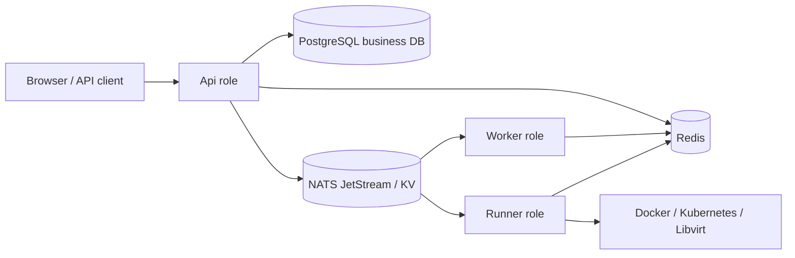

# NoCTF

NoCTF is a competition platform for CTF, AWD, AWDP, and KoH, built with .NET 10
and Nuxt 4. The current product and architecture contract lives in
[the authoritative documentation index](specs/README.md).

The project is licensed under [AGPL-3.0-only](LICENSE). See
[contributing](CONTRIBUTING.md), [security reporting](SECURITY.md), and
[asset credits](ASSET_CREDITS.md).

## Project status

NoCTF is currently in the 0.x release series. API and persistence changes may
require migration between releases. Use the documentation and deployment package
that match the installed revision, and review release notes before upgrading.

The Chinese platform user manual lives in [docs](docs/README.md), with detailed
installation, player, organizer, administrator, and operations guides.
Run it locally with Bun:

```sh
cd docs
bun install --frozen-lockfile
bun run docs:dev
```

## Capabilities

- Four built-in game modes: CTF, AWD, AWDP, and KoH.
- Reusable challenge templates with competition-specific scoring, hints, and runtime configuration.
- Durable submission evaluation, lifecycle, runtime, notification, and leaderboard workflows through Wolverine.
- Docker or Kubernetes for Container runtimes, and Libvirt/OVA for Virtual Machine runtimes, configured at deployment level.
- On-demand leaderboard projection with PostgreSQL facts, Redis snapshots, and SignalR updates.
- Strongly typed FastEndpoints contracts and a generated TypeScript OpenAPI client.
- Stable-resource GitOps workflows through ordinary Organizer Bot identities and existing management APIs.

Penetration content is ordinary CTF content, not a separate game mode. Dynamic game-mode
plugins and in-process business queues are not part of the target architecture.

## Architecture

The three production roles can run in one composable host or as independent processes:



- `NoCTF.API` owns HTTP, authentication, authorization, and SignalR.
- `NoCTF.Worker` owns durable business processing and leaderboard projection.
- `NoCTF.Runner` owns provider operations and checker/patch execution.
- `NoCTF.Host` enables any non-empty combination of `Api`, `Worker`, and `Runner` and
  defaults to all three. Combined roles still communicate through durable NATS JetStream queues.
- PostgreSQL is the business source of truth; NATS JetStream is the Wolverine durable transport.
- Redis supplies FusionCache's distributed cache and backplane. Runner registration,
  presence and resource-domain leases use NATS KV; authoritative allocations and
  request-admission quotas are stored in PostgreSQL.

Docker challenge services publish only their declared TCP ports and request host port
`0`; Docker assigns the random host ports used to expand public URLs. The platform does
not add an HAProxy or ingress-proxy layer for Docker runtimes.

## Technology

- Backend: .NET 10, FastEndpoints, EF Core 10, Npgsql/PostgreSQL, Wolverine, SignalR.
- Frontend: Nuxt 4, Vue 3, TypeScript, Vite, and Bun.
- Infrastructure: PostgreSQL, Redis, local or S3-compatible object storage.
- Runtime providers: Docker named-service Containers, Kubernetes service Pods, Libvirt/OVA.
- Tests: TUnit, NSubstitute, and Testcontainers against real dependencies.

## Deployment

Install the complete image published by GitHub Actions. Download the matching
deployment artifact, extract it, and run `bash deploy/configure.sh` from that
directory. No application source checkout or local build is needed. See
[image and deployment-package instructions](docs/installation/images.md).

### Deployment wizard

Use the deployment package's interactive wizard for Linux/WSL Docker or existing
Kubernetes. Both deployments migrate on Host startup. See [deployment entrypoints](deploy/README.md).

### Production Docker Compose

The single Compose definition contains the combined NoCTF Host, PostgreSQL, Redis, NATS,
and an authenticated Registry. It uses prebuilt images and directory bind mounts only.
No ports are published/exposed; operations connects its reverse proxy through the existing
`noctf-proxy` aliases `noctf-web:8080` and `noctf-registry:5000`.

```bash
bash deploy/docker/init-layout.sh /opt/noctf
# Fill /opt/noctf/.env with the CI image digest, existing/new secrets and real host names.
# Prepare Registry bcrypt credentials and Docker login as described in deploy/docker/README.md.
cd /opt/noctf
docker compose config --quiet
docker compose up -d
```

Migration runs inside NoCTF at startup; image health checks are in the Dockerfile.
Telemetry/exporters and proxy configuration are not part of the core deployment.
Use the independent [Prometheus/Grafana stack](deploy/docker/observability/README.md) when
operational monitoring is required. Read [Docker deployment](deploy/docker/README.md)
before migrating an existing installation:
never replace an existing named volume with an empty directory.

## Repository layout

```text
backend/
  src/
    NoCTF.API/             HTTP, auth, SignalR, and the ClientApp Nuxt SPA
    NoCTF.Worker/          durable application processing
    NoCTF.Runner/          runtime-provider execution
    NoCTF.Hosting/         shared role and durable-messaging composition
    NoCTF.Host/            configurable unified process
    NoCTF.Domain/          domain model and policies
    NoCTF.Application/     capability-oriented use cases
    NoCTF.Infrastructure/  provider-neutral relational model and infrastructure adapters
    NoCTF.Persistence.PostgreSql/ production provider and EF-generated InitialBaseline
    NoCTF.Persistence.Sqlite/     isolated test-only provider
    NoCTF.Modeling.Generators/    TPH leaf/catalog compile-time generation and diagnostics
  tests/NoCTF.Tests/       unit, architecture, and integration tests
deploy/                    Docker, Kubernetes, shared recovery/configuration assets
specs/                     authoritative product and engineering specifications
```

## Documentation

- [Documentation index and authority](specs/README.md)
- [Product and domain model](specs/product-domain.md)
- [System architecture](specs/architecture.md)
- [Processes, messaging, and concurrency](specs/processes-messaging.md)
- [Runtime contract](specs/runtime.md)
- [API reference](specs/api.md)
- [Deployment boundary](specs/deployment.md)
- [Development guide](specs/development.md)
- [Testing guide](specs/testing.md)
- [Challenge repository GitOps](specs/challenge-repository-gitops.md)

The separately maintained challenge-template repository's pinned CLI still emits
legacy Compose definitions. Its cross-repository compatibility check needs a
coordinated template update before that CLI can target the current named-service
Container contract. The independent `gitops-contract.yml` check tracks this boundary.

## Development and contributions

Install the .NET SDK selected by `global.json`, Bun 1.3.14, and Docker for real
dependency integration tests. Start with the [local development guide](docs/development/local.md).
The only executable backend project is `NoCTF.Host`; `NoCTF.API`, `NoCTF.Worker`,
and `NoCTF.Runner` are feature libraries.

Read [CONTRIBUTING.md](CONTRIBUTING.md) and the applicable `AGENTS.md` before making
changes. Pull requests run the backend checks in `repository-checks.yml`; frontend
and localization changes also run `localization.yml`, and documentation changes
run the documentation build. Image publishing invokes the same backend checks and
validates the frontend before building a full image.

## License

Copyright (C) 2026 NoCTF contributors.

NoCTF's original code and documentation are licensed under the GNU Affero General
Public License version 3 only. Modified versions that support remote network
interaction must offer their Corresponding Source to users interacting with them,
as described in section 13 of [LICENSE](LICENSE).

Third-party components retain their own licenses; see [THIRD_PARTY_NOTICES.md](THIRD_PARTY_NOTICES.md).
Project-created visual assets
are documented in [ASSET_CREDITS.md](ASSET_CREDITS.md).
